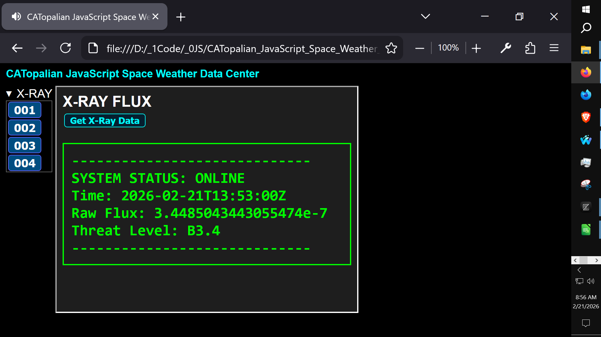
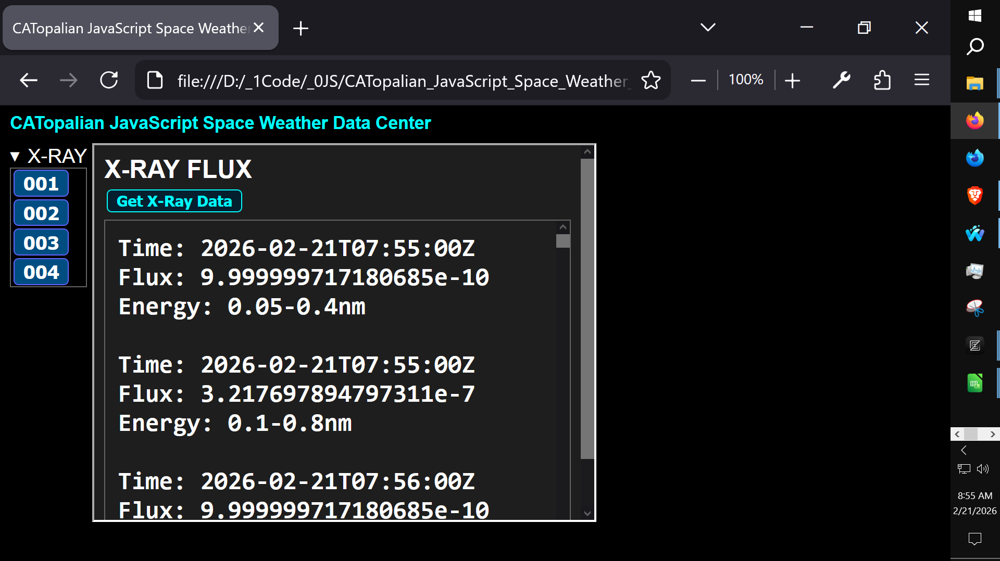

# CATopalian JavaScript Space Weather Data Center
This JavaScript app teaches incrementally how to fetch Space weather data and how to process it using HTML and JS.

---

Video: https://www.youtube.com/watch?v=AN8-o4M1Xw8

Use App: https://christopherandrewtopalian.github.io/CATopalian_JavaScript_Space_Weather_Data_Center/CATopalian_JavaScript_Space_Weather_Data_Center.html

---

### How to Download this App
1. Click the green Code Button on this github page
2. Choose Download ZIP
3. Save the Zip File
4. Extract All
5. Double click the HTML file to start the App

---

Happy Scripting :-)

---

//----//

// Dedicated to God the Father  
// All Rights Reserved Christopher Andrew Topalian Copyright 2000-2026  
// https://github.com/ChristopherTopalian  
// https://github.com/ChristopherAndrewTopalian  
// https://sites.google.com/view/CollegeOfScripting

